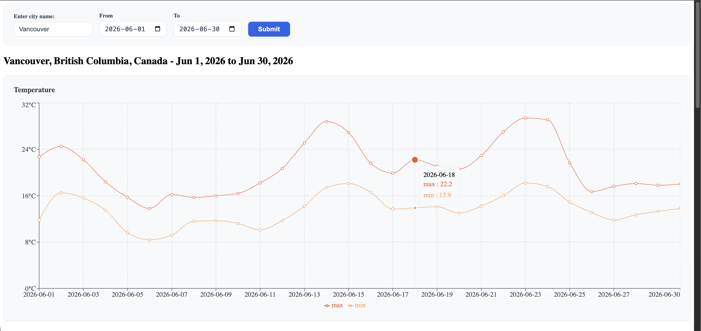
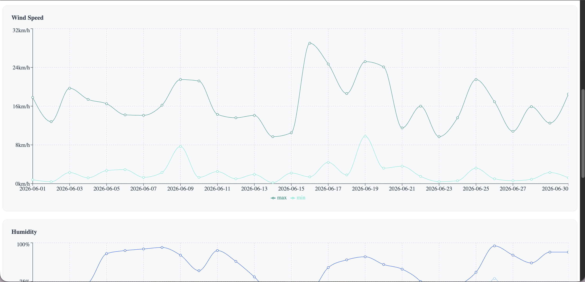
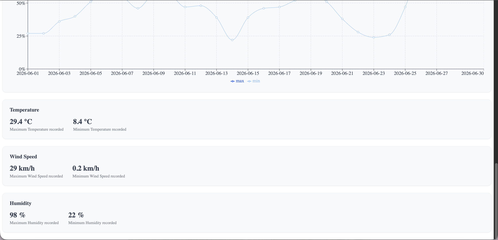

# Historical Weather Dashboard

A React dashboard that lets you search any city and view its historical weather data — daily temperature, humidity, and wind speed — over a custom date range, visualized with interactive charts.

**Live demo:** [historical-weather-dashboard-neel.netlify.app](https://historical-weather-dashboard-neel.netlify.app)

**Repo:** [github.com/neel1209/historical-weather-dashboard](https://github.com/neel1209/historical-weather-dashboard)

---

## Screenshots

**Search + temperature chart with interactive tooltip**


**Wind speed and humidity charts**


**Humidity chart and summary stat cards**


---

## Features

- 🔍 Search historical weather for any city worldwide
- 📅 Custom date range selection (up to 30 days)
- 📊 Three interactive line charts (temperature, humidity, wind speed) showing daily min/max values
- 🌍 Displays full location context (city, state/province, country)
- ⚠️ Input validation — prevents invalid date ranges before hitting the API
- ⏳ Loading and error states with clear user feedback
- 📱 Responsive, clean UI built with CSS Modules

---

## Tech Stack

- **React** + **Vite**
- **Recharts** — data visualization
- **Open-Meteo API** — free geocoding and historical weather data (no API key required)
- **CSS Modules** — scoped component styling
- **Netlify** — deployment

---

## What I Learned

This was my first full React project outside of tutorials, built with a custom hook + service layer architecture (`weatherApi.js` → `useWeather.js` → `Dashboard.jsx`) to keep API logic, state, and UI cleanly separated.

A few specific challenges I worked through:

- **Timezone/date parsing bug:** Dates passed as plain strings (e.g. `"2026-06-17"`) get parsed by JavaScript's `Date` constructor as UTC midnight. When converted to local time for display, this caused dates to shift backward by a day for users in timezones behind UTC. Fixed by manually parsing the date string into year/month/day components and using the local-time `Date(year, month, day)` constructor instead.
- **Race conditions on rapid searches:** Used `AbortController` inside the `useWeather` hook to cancel in-flight API requests when a new search is triggered before the previous one completes.
- **Keeping the UI responsive during state changes:** Restructured conditional rendering so the search bar stays visible during loading and error states, instead of being replaced by them — a small UX detail that meaningfully improves usability.

---

## Running Locally

```bash
git clone https://github.com/neel1209/historical-weather-dashboard.git
cd historical-weather-dashboard
npm install
npm run dev
```

The app will be available at `http://localhost:5173`.

No API key is required — Open-Meteo's geocoding and archive weather APIs are free and open.

---

## Acknowledgments

CSS styling for this project was completed with assistance from Claude Code.

---

## License

MIT
